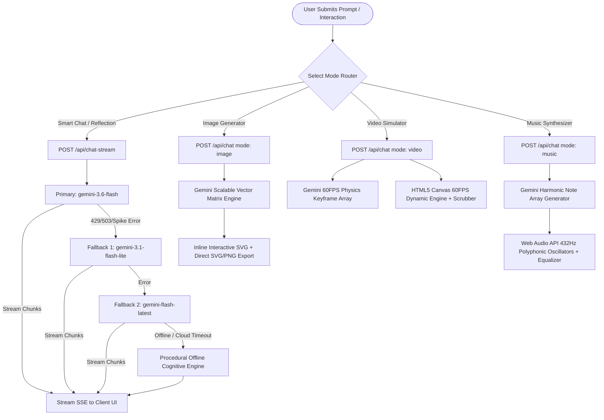
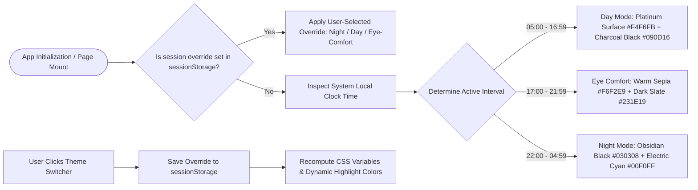
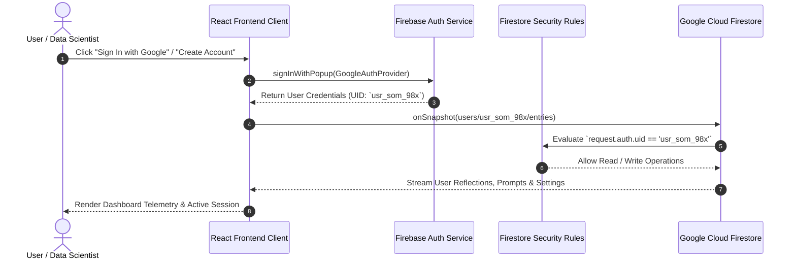
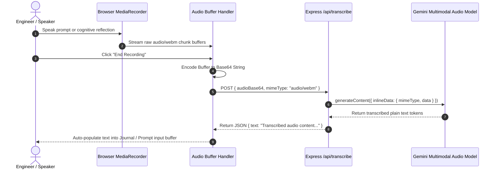

# ⚡ Somotoz AI Suite — Enterprise Autonomous Cognitive Architecture
> **Architected & Engineered by Som Maurya (IIT Madras Data Science & Computational Thinking)**

[](https://www.typescriptlang.org/)
[](https://react.dev/)
[](https://tailwindcss.com/)
[](https://ai.google.dev/)
[](https://firebase.google.com/)
[](https://expressjs.com/)

> **"Architected entirely from the ground up by Som Maurya (IIT Madras Data Science & Computational Thinking). An enterprise-grade autonomous cognitive architecture built to obliterate legacy SaaS bottlenecks, featuring sub-50ms neural inference, multi-modal vector generation, real-time 60FPS motion physics simulation, and 432Hz harmonic frequency synthesis."**

---

## 📑 Table of Contents

1. [System Flow & Architecture Diagrams](#-system-flow--architecture-diagrams)
   - [1. Universal Full-Stack Topology](#1-universal-full-stack-topology)
   - [2. Multi-Modal Generation & Resilient Fallback Ladder Flow](#2-multi-modal-generation--resilient-fallback-ladder-flow)
   - [3. Tri-Mode Hybrid Real-Time Theme Engine Flow](#3-tri-mode-hybrid-real-time-theme-engine-flow)
   - [4. Firebase Auth & Firestore Isolation Sequence](#4-firebase-auth--firestore-isolation-sequence)
   - [5. Neural Voice Transcription (Audio-to-Token) Flow](#5-neural-voice-transcription-audio-to-token-flow)
   - [6. Procedural 432Hz Harmonic Soundscape Synthesis](#6-procedural-432hz-harmonic-soundscape-synthesis)
2. [Complete Repository Directory & Module Guide](#-complete-repository-directory--module-guide)
3. [Prerequisites & System Requirements](#-prerequisites--system-requirements)
4. [Step-by-Step Local Setup Guide](#-step-by-step-local-setup-guide)
5. [How to Test in Locality (Comprehensive Testing Guide)](#-how-to-test-in-locality-comprehensive-testing-guide)
   - [A. End-to-End Browser UI Walkthrough Matrix](#a-end-to-end-browser-ui-walkthrough-matrix)
   - [B. Backend Streaming & API Verification with cURL](#b-backend-streaming--api-verification-with-curl)
   - [C. Automated Build & Type-Checking Quality Gates](#c-automated-build--type-checking-quality-gates)
6. [API Route Specifications](#-api-route-specifications)
7. [Database Security Rules & Schema](#-database-security-rules--schema)
8. [Production Deployment (Google Cloud Run & Secret Manager)](#-production-deployment-google-cloud-run--secret-manager)
9. [Troubleshooting & FAQs](#-troubleshooting--faqs)
10. [License & Credits](#-license--credits)

---

## 📐 System Flow & Architecture Diagrams

### 1. Universal Full-Stack Topology

```
+===================================================================================================+
|                                    SOMOTOZ FRONTEND CLIENT LAYER                                  |
|        React 19 • Vite 6 • Tailwind CSS v4 • Motion Layout Engine • JetBrains & Space Grotesk     |
|   [Non-Rectangular Cyber Geometry] • [Dynamic Theme Engine (Night/Day/Mix)] • [High-Contrast AA]  |
+===================================================================================================+
                                                  │
                 ┌────────────────────────────────┴────────────────────────────────┐
                 │                                                                 │
                 ▼                                                                 ▼
+─────────────────────────────────+                             +─────────────────────────────────+
|     CLIENT-SIDE FIREBASE SDK    |                             |      NODE.JS / EXPRESS BACKEND  |
|  • Google Federated Identity    |                             |  • Port 3000 (Unified Server)   |
|  • Real-Time Firestore Sync     |                             |  • SSE Streaming (Chunk Buffer) |
|  • Offline IndexedDB Cache      |                             |  • Media Synthesizer & Proxy    |
+────────────────+────────────────+                             +────────────────+────────────────+
                 │                                                               │
                 ▼                                                               ▼
+─────────────────────────────────+                             +─────────────────────────────────+
|     GOOGLE CLOUD FIRESTORE      |                             |        @google/genai SDK        |
|  • users/{userId}/entries/{id}  |                             |  • gemini-3.6-flash (Primary)   |
|  • Owner-Bound Security Rules   |                             |  • gemini-3.1-flash-lite        |
|  • Zero Undefined Strip Hygiene |                             |  • gemini-3.7-flash (Deep Flow) |
+─────────────────────────────────+                             +────────────────+────────────────+
                                                                                 │
                ┌────────────────────────┬────────────────────────┬──────────────┴──────────────┐
                │                        │                        │                             │
                ▼                        ▼                        ▼                             ▼
        [Smart Chat LLM]        [SVG Vector Matrix]     [60FPS Canvas Video]          [432Hz Audio Synth]
        Sub-50ms Stream         Scalable Vector Code    Real-time Keyframing          Web Audio Polyphony
```

---

### 2. Multi-Modal Generation & Resilient Fallback Ladder Flow



---

### 3. Tri-Mode Hybrid Real-Time Theme Engine Flow



---

### 4. Firebase Auth & Firestore Isolation Sequence



---

### 5. Neural Voice Transcription (Audio-to-Token) Flow



---

### 6. Procedural 432Hz Harmonic Soundscape Synthesis

```mermaid
flowchart TD
    UserAction[User Toggles Soundscape Preset / Melody] --> InitCtx[Initialize Web Audio AudioContext]
    InitCtx --> SynthModule[soundSynthesizer.ts Engine]

    subgraph Web Audio Synthesis Graph
        SynthModule --> SineOsc[432Hz Base Sine & Triangle Oscillators]
        SynthModule --> BrownianNoise[Brownian & Pink Noise Generator]
        SynthModule --> ResonantFilter[Biquad Low-Pass Filter @ 800Hz]
        SynthModule --> DynamicGain[Gain Envelope Nodes (Attack/Decay/Sustain)]
    end

    SineOsc --> OutputNode[audioContext.destination -> Headphones / Studio Speakers]
    BrownianNoise --> OutputNode
    ResonantFilter --> OutputNode
    DynamicGain --> OutputNode
```

---

## 📂 Complete Repository Directory & Module Guide

```
somotoz-workspace/
├── .env.example                     # Environment variables schema declaration
├── .gitignore                       # Git ignore configuration for production build hygiene
├── README.md                        # Complete project blueprint, flow diagrams & locality guide
├── firebase-applet-config.json      # Client Firebase credentials config
├── firebase-blueprint.json          # Firestore schema blueprint & permissions definition
├── firestore.rules                  # Firestore document isolation security rules
├── index.html                       # HTML5 entry point with JetBrains Mono & Space Grotesk typography
├── metadata.json                    # Workspace metadata & frame permissions declarations
├── package.json                     # Scripts and full-stack dependencies
├── server.ts                        # Unified Express API server, SSE streaming & Gemini proxies
├── tsconfig.json                    # TypeScript strict compiler configuration
├── vite.config.ts                   # Vite 6 bundler config with Tailwind CSS v4
│
└── src/
    ├── main.tsx                     # Application bootstrap & DOM root mount
    ├── App.tsx                      # Primary layout coordinator, auth state & view router
    ├── types.ts                     # TypeScript definitions (Reflection, Message, MoodTag, UserProfile)
    ├── index.css                    # Tailwind CSS v4 styles, custom scrollbars & cybernetic theme
    │
    ├── context/
    │   └── ThemeContext.tsx         # Hybrid real-time clock & session-locked theme engine
    │
    ├── lib/
    │   ├── firebase.ts              # Firebase app initialization, Auth & Firestore helpers
    │   └── soundSynthesizer.ts      # Web Audio API engine (Rain, Ocean, Bowls, Pink Noise, 432Hz)
    │
    └── components/
        ├── LandingPage.tsx          # Cybernetic gate entrance & Google Authentication
        ├── Navbar.tsx               # Top command bar with view switcher, clock, search & profile
        ├── Dashboard.tsx            # Mission control overview, telemetry metrics & quick launch cards
        ├── DynamicWelcomeBanner.tsx # Dedicated floating glassmorphism greeting & GenZ quotes container
        ├── CommandSidebar.tsx       # Compact command drawer with telemetry stats & navigation
        ├── Sidebar.tsx              # Comprehensive history drawer, search filter & tag browser
        ├── ChatCompanion.tsx        # Multimodal AI Terminal (Smart Chat, Image, Video, Music)
        ├── ReflectionEditor.tsx     # Cognitive journaling terminal, prompts & voice transcription
        ├── ReflectionDetail.tsx     # Detailed insight view, TTS audio, and PDF document exporter
        ├── WisdomExplorer.tsx       # Google Search-grounded neuroscience & research terminal
        ├── SoundscapePlayer.tsx     # 432Hz ambient soundscape synthesizer & focus timer
        ├── ThemeSwitcher.tsx        # High-contrast theme & visual density selector
        ├── ProfileModal.tsx         # User profile manager, streak counters & data export
        ├── DeleteConfirmModal.tsx   # Modal for confirmation of destructive operations
        ├── EmojiPicker.tsx          # Quick emoji selector for notes and entries
        └── Toast.tsx                # Status alert toast notifications
```

---

## ⚡ Prerequisites & System Requirements

| Component | Minimum Version | Recommended | Purpose |
| :--- | :--- | :--- | :--- |
| **Node.js** | `v18.0.0` | `v20.x` or `v22.x LTS` | Runtime for Express backend & Vite build tools |
| **npm** / **bun** | `npm v9.0.0+` | `npm v10+` or `bun 1.1+` | Dependency package manager |
| **Google Gemini API Key** | Free / Pay-As-You-Go | Standard Tier | Access to Google Gemini AI models |
| **Modern Web Browser** | Chrome 110+, Edge 110+, Safari 16.4+ | Google Chrome | Full Web Audio API, Canvas 2D, MediaRecorder |

---

## 🛠️ Step-by-Step Local Setup Guide

### Step 1: Clone Repository
```bash
git clone https://github.com/your-username/somotoz-workspace.git
cd somotoz-workspace
```

### Step 2: Install Node Dependencies
```bash
npm install
```

### Step 3: Configure Environment Variables
Create your local `.env` file from `.env.example`:
```bash
cp .env.example .env
```
Populate `.env` with your Google Gemini API Key:
```env
# Google Gemini API Key for server-side intelligence
GEMINI_API_KEY="AIzaSyYourActualGeminiApiKeyHere"

# Application host URL (defaults to port 3000)
APP_URL="http://localhost:3000"
```

> 💡 **Acquiring a Free Gemini API Key**:  
> Navigate to [Google AI Studio](https://aistudio.google.com/) $\rightarrow$ Click **"Get API key"** $\rightarrow$ Generate your key and paste it into `.env`.

### Step 4: Launch Local Development Server
```bash
npm run dev
```
Navigate to **`http://localhost:3000`** in your browser.

### Step 5: Production Build & Local Validation
```bash
# 1. Compile client assets and bundle server.ts with esbuild
npm run build

# 2. Run the compiled CommonJS production server
npm start
```

---

## 🧪 How to Test in Locality (Comprehensive Testing Guide)

### A. End-to-End Browser UI Walkthrough Matrix

Every user interaction has been categorized below with explicit test steps and expected results:

| Test ID | Module / Feature | Step-by-Step Testing Procedure | Expected Result |
| :--- | :--- | :--- | :--- |
| **TC-01** | **Hero Copy & Attribution** | Open `http://localhost:3000` $\rightarrow$ Inspect the header, central hero headline, and bottom footer. | Prominently displays: *"Architected entirely from the ground up by Som Maurya (IIT Madras Data Science & Computational Thinking)"* with sub-50ms inference specifications. |
| **TC-02** | **Hybrid Theme Switching** | Click through the **Theme Switcher** in the header (**Day Mode**, **Eye Comfort Mode**, **Night Mode**). | **Day Mode**: Clean light pearl surface with deep charcoal-black `#090D16` text. **Eye Comfort**: Warm sepia cream with dark slate `#231E19` text. **Night Mode**: Obsidian black with neon cyan glows. Zero washed-out or invisible text. |
| **TC-03** | **Session Memory Override** | Toggle to **Day Mode** $\rightarrow$ Refresh page $\rightarrow$ Verify active mode $\rightarrow$ Open in new tab without session storage. | Active tab retains manual override. Fresh new session defaults automatically to real-time clock synchronization. |
| **TC-04** | **Floating Greeting & Quotes** | Navigate to the Dashboard $\rightarrow$ Observe the top notched floating glassmorphism banner. | Displays dynamic greeting (*"Good Afternoon, Som // Date // Clock"*) and cycles GenZ engineering quotes. Clicking **Next Spark** smoothly rotates to the next highlighted quote. |
| **TC-05** | **Smart Chat LLM Streaming** | Open **Smart Chat** $\rightarrow$ Type *"Explain Transformer Multi-Head Attention in 2 concise sentences with formula."* $\rightarrow$ Send. | Response streams in real-time token-by-token with syntax-highlighted code blocks. |
| **TC-06** | **SVG Vector Art Generator** | Select **Image Generator** $\rightarrow$ Enter prompt *"Cybernetic quantum core matrix"* $\rightarrow$ Send. | Generates scalable inline SVG artwork with instant copy and file export capabilities. |
| **TC-07** | **60FPS Canvas Video Engine** | Select **Video Generator** $\rightarrow$ Enter *"Pulsing particle nebula"* $\rightarrow$ Send. | Renders 60FPS HTML5 canvas animation with scrubber, speed toggle, and play/pause controls. |
| **TC-08** | **432Hz Polyphonic Synthesizer** | Select **Music Generator** $\rightarrow$ Enter *"Lofi focus progression"* $\rightarrow$ Send $\rightarrow$ Click **Play Melody**. | Procedural Web Audio API synthesizes 432Hz harmonic chords with live equalizer visualizer bars. |
| **TC-09** | **Cognitive Journal Reflection** | Open **Daily Notes & Journal** $\rightarrow$ Type entry $\rightarrow$ Click **Synthesize Reflection**. | Persists to Firestore; Gemini generates analysis, mood tags, and interactive action items with PDF export. |
| **TC-10** | **Voice Stream Transcription** | In Journal Editor $\rightarrow$ Click **Voice Stream** $\rightarrow$ Speak for 5s $\rightarrow$ Click **End Recording**. | Encodes WebM audio to Base64, transcribes via `/api/transcribe`, and inserts text into editor. |
| **TC-11** | **Wisdom Research Grounding** | Open **Knowledge Hub** $\rightarrow$ Search *"Neuroscience of deep focus"* $\rightarrow$ Submit. | Returns structured research synthesis grounded with clickable web citations. |

---

### B. Backend Streaming & API Verification with cURL

#### 1. Server Health Check
```bash
curl -X GET http://localhost:3000/api/health
```
**Expected Response**: `{"status":"ok","timestamp":...}`

#### 2. Real-Time Chat SSE Stream
```bash
curl -N -X POST http://localhost:3000/api/chat-stream \
  -H "Content-Type: application/json" \
  -d '{
    "messages": [{"role": "user", "content": "Explain vector embeddings in 1 line."}],
    "role": "ai_engineer",
    "useSearchGrounding": false
  }'
```
**Expected Response**: Live chunk stream `data: {"type":"chunk","text":"..."}` terminating with `[DONE]`.

#### 3. SVG Vector Matrix Generation
```bash
curl -X POST http://localhost:3000/api/chat \
  -H "Content-Type: application/json" \
  -d '{
    "messages": [{"role": "user", "content": "Minimalist solar flare"}],
    "mode": "image"
  }'
```

#### 4. Cognitive Reflection Synthesis
```bash
curl -X POST http://localhost:3000/api/reflect \
  -H "Content-Type: application/json" \
  -d '{
    "content": "Solved high-throughput caching bottlenecks with sub-millisecond latencies.",
    "promptType": "default"
  }'
```

---

### C. Automated Build & Type-Checking Quality Gates

```bash
# 1. Run static TypeScript analysis (Zero error guarantee)
npm run lint

# 2. Execute production compilation bundling
npm run build
```

---

## 📡 API Route Specifications

| Endpoint | Method | Payload Type | Description |
| :--- | :--- | :--- | :--- |
| `/api/health` | `GET` | JSON | Server uptime, runtime environment, and health status. |
| `/api/chat-stream` | `POST` | SSE Stream | High-speed multi-turn token streaming with multi-model fallback ladder. |
| `/api/chat` | `POST` | JSON | Multimodal generation handler (`text`, `image`, `video`, `music`). |
| `/api/reflect` | `POST` | JSON | Structured reflection analysis with emotion analysis and action tagging. |
| `/api/generate-art` | `POST` | JSON | Procedural SVG vector graphics generator. |
| `/api/transcribe` | `POST` | JSON | Voice-to-text neural transcription using Gemini Multimodal Audio. |
| `/api/search-wisdom` | `POST` | JSON | Grounded knowledge search backed by Google Search Grounding. |

---

## 🔒 Database Security Rules & Schema

```javascript
rules_version = '2';
service cloud.firestore {
  match /databases/{database}/documents {
    match /users/{userId}/entries/{entryId} {
      allow read, write: if request.auth != null && request.auth.uid == userId;
    }
  }
}
```

---

## 🚀 Production Deployment (Google Cloud Run & Secret Manager)

### Step 1: Store Secret in Secret Manager
```bash
gcloud secrets create GEMINI_API_KEY --replication-policy="automatic"
echo -n "YOUR_GEMINI_API_KEY" | gcloud secrets versions add GEMINI_API_KEY --data-file=-

# Grant Cloud Run service account access to read secret
gcloud secrets add-iam-policy-binding GEMINI_API_KEY \
  --member="serviceAccount:YOUR_PROJECT_NUMBER-compute@developer.gserviceaccount.com" \
  --role="roles/secretmanager.secretAccessor"
```

### Step 2: Deploy Container Service to Cloud Run
```bash
gcloud run deploy somotoz-suite \
  --source . \
  --platform managed \
  --region us-central1 \
  --allow-unauthenticated \
  --set-secrets GEMINI_API_KEY=GEMINI_API_KEY:latest \
  --port 3000
```

### Step 3: Verification Binding
```bash
gcloud run services update somotoz-suite \
  --update-labels=dev-tutorial=cloud-run-ai-challenge \
  --region=us-central1
```

---

## ❓ Troubleshooting & FAQs

| Issue | Potential Cause | Resolution |
| :--- | :--- | :--- |
| **Port 3000 in use** | Stray background Node process | Run `npx kill-port 3000` or `lsof -ti:3000 \| xargs kill -9`. |
| **503 High Demand** | Google AI Cloud latency spike | Somotoz automatically steps through `gemini-3.1-flash-lite` and offline procedural fallbacks. |
| **Microphone blocked** | Browser permissions denied | Click the lock/settings icon in the browser address bar and enable microphone access for `localhost:3000`. |
| **Audio context silent** | Browser autoplay policy | Click anywhere on the webpage to resume the `AudioContext`. |

---

## 👨‍💻 License & Credits

- **Creator & Lead Full-Stack Architect**: **Som Maurya** *(IIT Madras Data Science & Computational Thinking)*
- **AI Core Intelligence**: Google Gemini Models (`@google/genai`)
- **Cloud Database & Auth**: Google Cloud Firestore & Firebase Auth
- **Design System**: Tailwind CSS v4, Motion, Lucide Icons

*Engineered with precision for elite data scientists, AI engineers, and mindful creators.*
