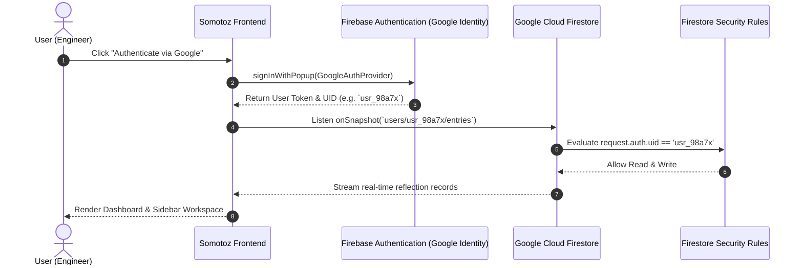
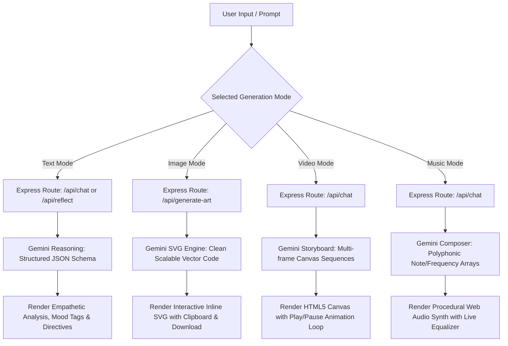
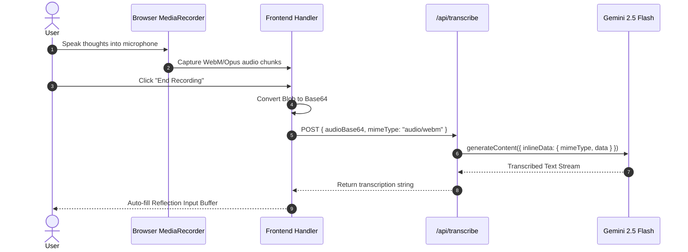

# Somotoz - AI Multimodal Suite & Engineering Workspace
> **Developed by Som Maurya**

An advanced AI Engineer multimodal companion, creative studio, and cognitive reflection workspace built with **React 19**, **Tailwind CSS**, **Node.js / Express**, **Google Gemini 2.5/2.0 AI**, and **Firebase Cloud Firestore**. 

Somotoz unifies deep cognitive reasoning, text-to-vector artwork synthesis, interactive canvas video storyboarding, real-time Web Audio API music synthesis, voice-to-text neural transcription, grounded web research, and ambient soundscapes under a sleek cybernetic dark interface.

---

## 📑 Table of Contents

1. [Architecture & System Flow Diagrams](#-architecture--system-flow-diagrams)
   - [High-Level System Architecture](#1-high-level-system-architecture)
   - [Authentication & Firestore Isolation Flow](#2-authentication--firestore-isolation-flow)
   - [Gemini Multimodal Processing Pipeline](#3-gemini-multimodal-processing-pipeline)
   - [Voice Transcription & Audio Pipeline](#4-voice-transcription--audio-pipeline)
2. [Key Feature Capabilities](#-key-feature-capabilities)
3. [Repository Directory Guide](#-repository-directory-guide)
4. [Prerequisites & Requirements](#-prerequisites--requirements)
5. [Local Development & Setup Guide](#-local-development--setup-guide)
   - [Step 1: Clone & Install](#step-1-clone--install-dependencies)
   - [Step 2: Configure Environment Variables](#step-2-configure-environment-variables)
   - [Step 3: Start the Local Dev Server](#step-3-start-the-local-development-server)
   - [Step 4: Build for Production Locally](#step-4-build-and-preview-locally)
6. [Complete Local Testing Verification Checklist](#-complete-local-testing-verification-checklist)
7. [Backend API Reference](#-backend-api-reference)
8. [Security Hardening & Firestore Rules](#-security-hardening--firestore-rules)
9. [Google Cloud Run Deployment](#-google-cloud-run-deployment)
10. [Troubleshooting & FAQs](#-troubleshooting--faqs)
11. [Author & Credits](#-author--credits)

---

## 📐 Architecture & System Flow Diagrams

### 1. High-Level System Architecture

```
                                  +--------------------------------------------------+
                                  |                 CLIENT BROWSER                   |
                                  |   (React 19 + Tailwind + Motion + Web Audio)     |
                                  +------------------------+-------------------------+
                                                           |
                      +------------------------------------+------------------------------------+
                      |                                                                         |
                      v                                                                         v
      +-------------------------------+                                         +-------------------------------+
      |    CLIENT-SIDE FIREBASE SDK   |                                         |     EXPRESS BACKEND SERVER    |
      |   (Auth & Firestore Realtime) |                                         |   (Port 3000 / Node.js ESM)   |
      +---------------+---------------+                                         +---------------+---------------+
                      |                                                                         |
                      v                                                                         v
      +-------------------------------+                                         +-------------------------------+
      |    GOOGLE CLOUD FIRESTORE     |                                         |       GEMINI AI SDK           |
      |  users/{uid}/entries/{doc}    |                                         | (@google/genai 2.5/2.0 Models)|
      +-------------------------------+                                         +---------------+---------------+
                                                                                                |
                                                                        +-----------------------+-----------------------+
                                                                        |                       |                       |
                                                                        v                       v                       v
                                                                 [Text & Insights]       [SVG Vector Art]      [Voice Transcribe]
```

---

### 2. Authentication & Firestore Isolation Flow



---

### 3. Gemini Multimodal Processing Pipeline



---

### 4. Voice Transcription & Audio Pipeline



---

## 🌟 Key Feature Capabilities

| Feature | Description | Engine / Stack |
| :--- | :--- | :--- |
| **Cognitive Reflection Terminal** | Process daily challenges, engineering burnout, and mental models with multi-factor synthesis. | Gemini 2.5 Flash + Firestore |
| **Voice Audio Stream** | Seamless voice journaling with real-time speech transcription. | Web Audio + Gemini Multimodal |
| **Vector Artwork Studio** | Procedural, high-resolution SVG artwork generation tailored to mood and reflection keywords. | Gemini Generative Vector Engine |
| **Canvas Video Storyboard** | Multi-frame animated canvas video visualizers with scrub controls and variable frame rates. | HTML5 Canvas + Motion Loop |
| **Procedural Music Synth** | Melodic 432Hz ambient chord progressions synthesized in real time without audio files. | Browser Web Audio API Oscillators |
| **Verified Research Hub** | Grounded cognitive neuroscience search with real-time citations and scientific summaries. | Gemini Google Search Grounding |
| **Ambient Soundscapes** | Rain, ocean waves, forest breeze, Tibetan singing bowl, and pink noise focus generators. | Procedural Web Audio Synthesizer |
| **Encrypted User Isolation** | Private user partitions with strict Firestore security rules (`users/{userId}/entries`). | Firebase Auth + Security Rules |

---

## 📂 Repository Directory Guide

```
somotoz-workspace/
├── .env.example                  # Environment variable blueprint
├── .gitignore                    # Ignored artifacts (node_modules, dist, etc.)
├── README.md                     # Comprehensive documentation & project guide
├── firebase-applet-config.json   # Firebase client app credentials
├── firebase-blueprint.json       # Firestore database schema & collections
├── firestore.rules               # Firestore security isolation rules
├── index.html                    # HTML document root with Inter/JetBrains Mono fonts
├── metadata.json                 # AI Studio capability declarations & permissions
├── package.json                  # Scripts & dependencies (React 19, Gemini SDK, Express)
├── server.ts                     # Express server & Gemini API proxy routes
├── tsconfig.json                 # TypeScript strict compiler configuration
├── vite.config.ts                # Vite 6 configuration with Tailwind CSS v4 plugin
└── src/
    ├── App.tsx                   # Main state coordinator & view router
    ├── main.tsx                  # React DOM entry point
    ├── index.css                 # Tailwind CSS v4 root stylesheet
    ├── types.ts                  # Shared TypeScript interfaces & models
    ├── lib/
    │   ├── firebase.ts           # Firebase Auth & Firestore client initialization
    │   └── soundSynthesizer.ts   # Web Audio API ambient soundscape generator
    └── components/
        ├── Navbar.tsx            # Navigation header with view tabs & user status
        ├── Sidebar.tsx           # History drawer, search, favorites, & tags
        ├── LandingPage.tsx       # Cybernetic entrance screen & Google sign-in
        ├── DynamicWelcomeBanner.tsx # Typewriter terminal welcome transmission
        ├── ReflectionEditor.tsx  # Ingestion terminal, prompts & voice stream
        ├── ReflectionDetail.tsx  # Full analysis view, TTS speech, takeaways
        ├── ChatCompanion.tsx     # Multimodal AI Chat (Text, Image, Video, Music)
        ├── WisdomExplorer.tsx    # Grounded research & neuroscience hub
        ├── SoundscapePlayer.tsx  # Focus timer & ambient soundscape player
        ├── DeleteConfirmModal.tsx# Safety confirmation dialog for data purging
        └── Toast.tsx             # Animated status alerts & notifications
```

---

## ⚡ Prerequisites & Requirements

Before testing or developing locally, ensure you have:

- **Node.js**: v18.0.0 or higher (v20+ recommended).
- **npm** or **bun**: npm v9+ or bun v1.1+.
- **Google Gemini API Key**: Obtain a free key from [Google AI Studio](https://aistudio.google.com/).
- **Modern Web Browser**: Chrome, Edge, Safari, or Firefox with Web Audio API and Microphone support.

---

## 🛠️ Local Development & Setup Guide

Follow these step-by-step instructions to run and test the complete application on your local machine:

### Step 1: Clone & Install Dependencies

```bash
# 1. Clone the repository
git clone https://github.com/your-username/somotoz-workspace.git
cd somotoz-workspace

# 2. Install all required dependencies
npm install
```

### Step 2: Configure Environment Variables

Create a local `.env` file from the provided `.env.example`:

```bash
cp .env.example .env
```

Open `.env` and configure your API keys:

```env
# Google Gemini API Key for server-side AI endpoints
GEMINI_API_KEY="AIzaSyYourActualGeminiApiKeyHere"

# Optional App URL (defaults to http://localhost:3000 in dev)
APP_URL="http://localhost:3000"
```

> **Note on Firebase**: Client-side Firebase credentials are pre-configured in `firebase-applet-config.json` and loaded automatically via `src/lib/firebase.ts`. If you prefer to use your own Firebase project, update `firebase-applet-config.json` with your project's `apiKey`, `authDomain`, and `projectId`.

### Step 3: Start the Local Development Server

Run the development command:

```bash
npm run dev
```

The Express backend and Vite frontend will compile and launch on:
👉 **`http://localhost:3000`**

Open your browser to `http://localhost:3000` to interact with Somotoz.

### Step 4: Build and Preview Locally

To verify production compilation with `esbuild` and Vite:

```bash
# 1. Build the production client bundle and server binary
npm run build

# 2. Start the production server
npm start
```

---

## 🧪 Complete Local Testing Verification Checklist

Use this checklist to test all features locally:

### 1. Authentication & Session Flow
- [ ] Open `http://localhost:3000`. You will see the **Somotoz Cybernetic Landing Page**.
- [ ] Click **"Authenticate via Google"**. Complete the Google OAuth popup.
- [ ] Verify that you are redirected to the main dashboard with your name and avatar displayed in the top navbar.

### 2. Reflection Input & AI Synthesis
- [ ] In the **Journal / Terminal** tab, notice the **Dynamic Welcome Terminal** typing system prompts.
- [ ] Click **Next Transmission** to cycle greetings.
- [ ] Type a reflection or select one of the **Cognitive Ingestion Templates** (e.g. *Deconstruct Tension*).
- [ ] Press **Ctrl + Enter** (or click **Synthesize Reflection**).
- [ ] Verify that the pulsing loading state shows step-by-step progress and redirects to the **Reflection Detail** view.
- [ ] Confirm that:
  - Empathetic perspective reframing is generated.
  - Mood tags are extracted.
  - Interactive micro-takeaways can be checked/unchecked.

### 3. Voice Stream & Speech Transcription
- [ ] In the editor, click **Voice Stream**.
- [ ] Allow microphone access in your browser.
- [ ] Speak for 5–10 seconds, then click **End Recording**.
- [ ] Verify that the audio is transcribed and inserted directly into the text editor.

### 4. Multimodal Generation Suite (Chat Tab)
- [ ] Switch to the **Multimodal Chat** tab in the top navigation.
- [ ] **Text Mode**: Send a prompt like *"Help me break down impostor syndrome"*. Verify empathetic response.
- [ ] **Image Mode**: Switch selector to **Image** and send *"Abstract neon neural network"*. Verify SVG vector artwork is rendered inline with a **Download SVG** button.
- [ ] **Video Mode**: Switch selector to **Video** and send *"Breathing loop animation"*. Verify an animated HTML5 Canvas storyboard plays with Play/Pause controls.
- [ ] **Music Mode**: Switch selector to **Music** and send *"Serene 432Hz ambient focus loop"*. Click **Play Melody** and verify Web Audio sounds with active equalizer bars.

### 5. Grounded Research & Wisdom Hub
- [ ] Switch to the **Research Hub** tab.
- [ ] Click a featured topic (e.g., *5-4-3-2-1 Somatic Grounding*) or enter a search query.
- [ ] Verify the synthesized research output appears alongside clickable grounding citation links.

### 6. Ambient Acoustics & Focus Timer
- [ ] Switch to the **Soundscapes** tab.
- [ ] Click on **Gentle Rain** or **Tibetan Singing Bowl**.
- [ ] Verify real-time Web Audio synthesis begins immediately.
- [ ] Adjust volume and set a **15m** session timer.

---

## 📡 Backend API Reference

All AI calls are securely routed through server-side Express endpoints to keep keys confidential:

| Endpoint | Method | Payload | Description |
| :--- | :--- | :--- | :--- |
| `/api/reflect` | `POST` | `{ content: string, promptType?: string }` | Analyzes reflection, creates title, mood tags, and action items. |
| `/api/chat` | `POST` | `{ message: string, history: Array, mode: "text"\|"image"\|"video"\|"music", contextEntry?: object }` | Multimodal conversational model yielding text, SVGs, animation loops, or chords. |
| `/api/generate-art` | `POST` | `{ reflectionText: string, moodTags: string[] }` | Generates a custom inline SVG illustration matching entry moods. |
| `/api/transcribe` | `POST` | `{ audioBase64: string, mimeType: string }` | Transcribes spoken voice recordings via Gemini multimodal input. |
| `/api/search-wisdom`| `POST` | `{ query: string }` | Real-time scientific research grounding with Google Search. |

---

## 🔒 Security Hardening & Firestore Rules

User reflection data is isolated so that users can only read, create, update, and delete their own records.

### `firestore.rules`
```javascript
rules_version = '2';
service cloud.firestore {
  match /databases/{database}/documents {
    match /users/{userId}/entries/{entryId} {
      allow read, write: if request.auth != null && request.auth.uid == userId;
    }
  }
}
```

---

## 🚀 Google Cloud Run Deployment

### 1. Enable Cloud APIs
```bash
gcloud services enable \
  run.googleapis.com \
  secretmanager.googleapis.com \
  firestore.googleapis.com \
  aiplatform.googleapis.com
```

### 2. Store Gemini Secret in Secret Manager
```bash
# 1. Create Secret
gcloud secrets create GEMINI_API_KEY --replication-policy="automatic"

# 2. Add API Key Value
echo -n "YOUR_GEMINI_API_KEY" | gcloud secrets versions add GEMINI_API_KEY --data-file=-

# 3. Grant Secret Access to Default Compute Account
PROJECT_NUMBER=$(gcloud projects describe $(gcloud config get-value project) --format="value(projectNumber)")
gcloud secrets add-iam-policy-binding GEMINI_API_KEY \
  --member="serviceAccount:${PROJECT_NUMBER}-compute@developer.gserviceaccount.com" \
  --role="roles/secretmanager.secretAccessor"
```

### 3. Deploy to Cloud Run
```bash
gcloud run deploy somotoz \
  --source . \
  --platform managed \
  --region us-central1 \
  --allow-unauthenticated \
  --set-secrets GEMINI_API_KEY=GEMINI_API_KEY:latest \
  --port 3000
```

---

## ❓ Troubleshooting & FAQs

**Q: Microphone recording fails during Voice Stream?**  
A: Ensure your browser has permitted microphone access. If testing on Chrome, verify that `localhost` is treated as a secure origin or test over HTTPS.

**Q: Gemini API returns a 500 error on local test?**  
A: Verify that `GEMINI_API_KEY` is present in your `.env` file and has valid quota in Google AI Studio.

**Q: Web Audio produces no sound in Soundscapes or Music mode?**  
A: Modern browsers require a user gesture before starting the `AudioContext`. Click anywhere inside the application window or on a play button to unlock audio playback.

---

## 👨‍💻 Author & Credits

- **Project Lead & Developer**: Som Maurya
- **AI Architecture**: Google Gemini 2.5/2.0 Models
- **Database & Cloud**: Google Cloud Firestore & Firebase Auth
- **UI & Motion**: React 19, Tailwind CSS v4, Motion

*Built with precision for engineers, creators, and reflective minds.*

