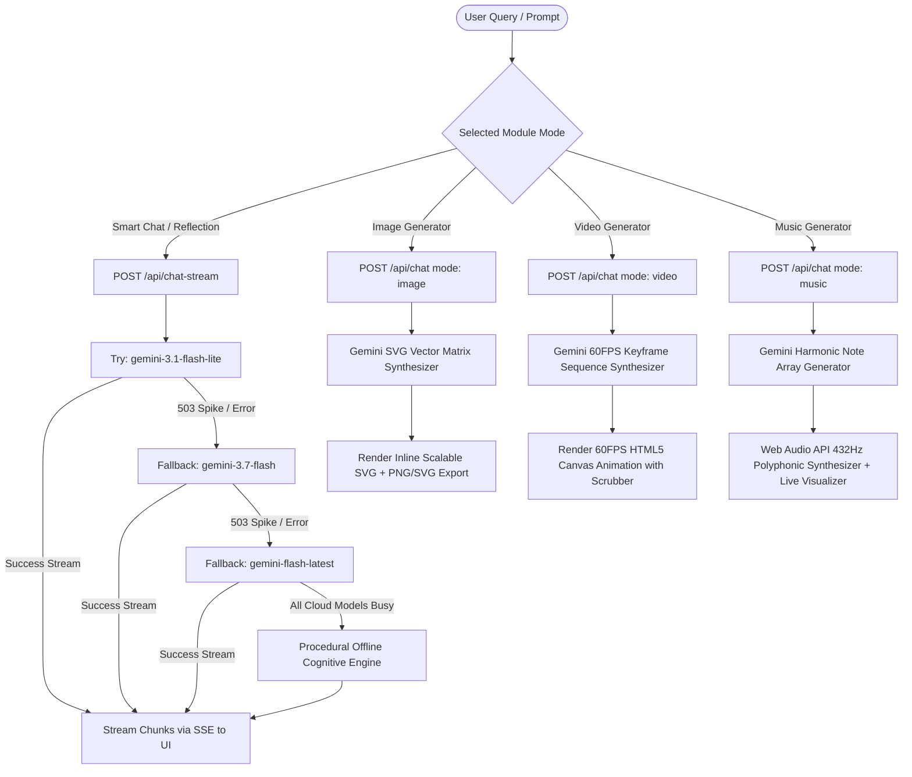
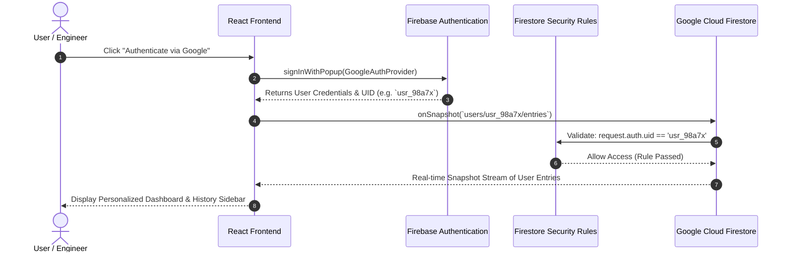
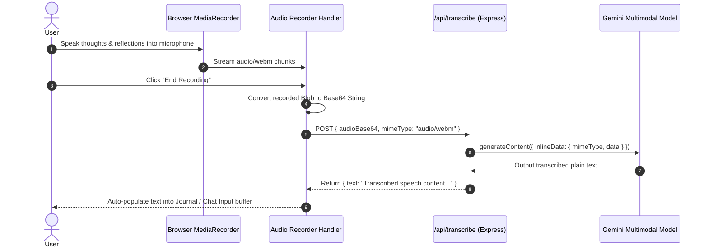
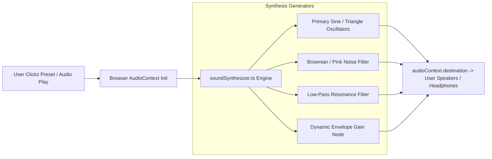

# ⚡ Somotoz AI Suite — Multimodal Intelligence & Cognitive Studio
> **Architected & Engineered by Som Maurya**

[](https://www.typescriptlang.org/)
[](https://react.dev/)
[](https://tailwindcss.com/)
[](https://ai.google.dev/)
[](https://firebase.google.com/)
[](https://expressjs.com/)

An enterprise-grade, full-stack AI engineering suite and cognitive reflection workspace. Somotoz unifies **Multi-turn LLM reasoning**, **Dynamic Scalable Vector (SVG) art synthesis**, **60FPS Canvas Video motion keyframing**, **432Hz Procedural Web Audio music synthesis**, **Neural voice-to-text transcription**, **Google Search-grounded neuroscience research**, and **Zero-Downtime Fallback Pipelines** within a high-performance cybernetic terminal interface.

---

## 📑 Table of Contents

1. [Architecture & Flow Diagrams](#-architecture--system-flow-diagrams)
   - [1. High-Level Full-Stack Architecture](#1-high-level-full-stack-architecture)
   - [2. Multimodal Streaming & Zero-Downtime Fallback Pipeline](#2-multimodal-streaming--zero-downtime-fallback-pipeline)
   - [3. Authentication & Firestore Security Isolation Flow](#3-authentication--firestore-security-isolation-flow)
   - [4. Voice-to-Text Neural Transcription Flow](#4-voice-to-text-neural-transcription-flow)
   - [5. Procedural 432Hz Soundscape & Music Synthesis Flow](#5-procedural-432hz-soundscape--music-synthesis-flow)
2. [Complete Repository Directory & Module Guide](#-complete-repository-directory--module-guide)
3. [Prerequisites & System Requirements](#-prerequisites--system-requirements)
4. [Step-by-Step Local Setup Guide](#-step-by-step-local-setup-guide)
   - [Step 1: Clone Repository](#step-1-clone-repository)
   - [Step 2: Install Node Dependencies](#step-2-install-node-dependencies)
   - [Step 3: Configure Environment Variables](#step-3-configure-environment-variables)
   - [Step 4: Launch Local Development Server](#step-4-launch-local-development-server)
   - [Step 5: Production Build & Local Validation](#step-5-production-build--local-validation)
5. [How to Test in Locality (Comprehensive Testing Guide)](#-how-to-test-in-locality-comprehensive-testing-guide)
   - [A. End-to-End Browser UI Testing Guide](#a-end-to-end-browser-ui-testing-guide)
   - [B. Backend API & Streaming CLI Testing with cURL](#b-backend-api--streaming-cli-testing-with-curl)
   - [C. Automated Code Quality & Lint Validation](#c-automated-code-quality--lint-validation)
6. [API Route Specifications](#-api-route-specifications)
7. [Database Security Rules & Schema](#-database-security-rules--schema)
8. [Production Deployment (Google Cloud Run & Docker)](#-production-deployment-google-cloud-run--docker)
9. [Troubleshooting & FAQs](#-troubleshooting--faqs)
10. [License & Credits](#-license--credits)

---

## 📐 Architecture & System Flow Diagrams

### 1. High-Level Full-Stack Architecture

```
                                  +-------------------------------------------------------------+
                                  |                     CLIENT WEB APPLICATION                  |
                                  |    (React 19, Vite 6, Tailwind CSS v4, Motion, Lucide)      |
                                  +------------------------------+------------------------------+
                                                                 |
                                 +-------------------------------+-------------------------------+
                                 |                                                               |
                                 v                                                               v
                 +-------------------------------+                               +-------------------------------+
                 |    CLIENT-SIDE FIREBASE SDK   |                               |     EXPRESS BACKEND SERVER    |
                 |   (Auth & Firestore Realtime) |                               |     (Port 3000 / Node.js ESM) |
                 +---------------+---------------+                               +---------------+---------------+
                                 |                                                               |
                                 v                                                               v
                 +-------------------------------+                               +-------------------------------+
                 |    GOOGLE CLOUD FIRESTORE     |                               |      @google/genai SDK        |
                 |   users/{uid}/entries/{doc}   |                               |  (Gemini 3.1 / 3.7 Flash)     |
                 +-------------------------------+                               +---------------+---------------+
                                                                                                 |
                                                 +-----------------------+-----------------------+-----------------------+
                                                 |                       |                       |                       |
                                                 v                       v                       v                       v
                                        [Text Reasoning]        [SVG Vector Art]        [Canvas 60FPS Video]    [432Hz Music Synth]
```

---

### 2. Multimodal Streaming & Zero-Downtime Fallback Pipeline



---

### 3. Authentication & Firestore Security Isolation Flow



---

### 4. Voice-to-Text Neural Transcription Flow



---

### 5. Procedural 432Hz Soundscape & Music Synthesis Flow



---

## 📂 Complete Repository Directory & Module Guide

```
somotoz-workspace/
├── .env.example                     # Environment variables template
├── .gitignore                       # Git ignore configuration
├── README.md                        # Complete documentation, architecture & test guide
├── firebase-applet-config.json      # Client Firebase credentials config
├── firebase-blueprint.json          # Firestore schema blueprint & permissions definition
├── firestore.rules                  # Firestore document isolation security rules
├── index.html                       # HTML5 template with Inter & JetBrains Mono typography
├── metadata.json                    # Workspace metadata & permission declarations
├── package.json                     # Project scripts and full-stack dependencies
├── server.ts                        # Express API server, SSE streaming & Gemini proxies
├── tsconfig.json                    # TypeScript compiler configuration (strict mode)
├── vite.config.ts                   # Vite 6 bundler config with Tailwind CSS v4
│
└── src/
    ├── main.tsx                     # Application bootstrap & DOM root mount
    ├── App.tsx                      # Primary layout coordinator, auth state & view router
    ├── types.ts                     # TypeScript definitions (Reflection, Message, MoodTag, etc.)
    ├── index.css                    # Tailwind CSS v4 styles, custom scrollbars & cybernetic theme
    │
    ├── lib/
    │   ├── firebase.ts              # Firebase app initialization, Auth & Firestore helpers
    │   └── soundSynthesizer.ts      # Web Audio API engine (Rain, Ocean, Bowls, Pink Noise)
    │
    └── components/
        ├── Dashboard.tsx            # Mission control overview, telemetry metrics & quick launch cards
        ├── CommandSidebar.tsx       # Compact command drawer with telemetry stats & navigation
        ├── Sidebar.tsx              # Comprehensive history drawer, search filter & tag browser
        ├── Navbar.tsx               # Top command bar with view switcher, clock, search & profile
        ├── ChatCompanion.tsx        # Multimodal AI Terminal (Smart Chat, Image, Video, Music)
        ├── ReflectionEditor.tsx     # Cognitive journaling terminal, prompts & voice transcription
        ├── ReflectionDetail.tsx     # Detailed insight view, TTS audio, and PDF document exporter
        ├── WisdomExplorer.tsx       # Google Search-grounded neuroscience & research terminal
        ├── SoundscapePlayer.tsx     # 432Hz ambient soundscape synthesizer & focus timer
        ├── LandingPage.tsx          # Cybernetic gate entrance & Google Authentication
        ├── DynamicWelcomeBanner.tsx # Dynamic typewriter telemetry greeting transmission
        ├── ThemeSwitcher.tsx        # High-contrast theme & visual density selector
        ├── ProfileModal.tsx         # User profile manager, streak counters & data export
        ├── DeleteConfirmModal.tsx   # Modal for confirmation of destructive operations
        ├── EmojiPicker.tsx          # Quick emoji selector for notes and entries
        └── Toast.tsx                # Status alert toast notifications
```

---

## ⚡ Prerequisites & System Requirements

Before running or testing Somotoz locally, make sure your machine satisfies:

| Requirement | Minimum Version | Recommended | Purpose |
| :--- | :--- | :--- | :--- |
| **Node.js** | `v18.0.0` | `v20.x` or `v22.x LTS` | Runtime for Express backend & tooling |
| **npm** / **bun** | `npm v9.0.0+` | `npm v10+` or `bun 1.1+` | Package management |
| **Google Gemini API Key** | Free Tier | Standard Pay-as-you-go | Access to Gemini models (`gemini-3.1-flash-lite`, etc.) |
| **Modern Browser** | Chrome 110+, Edge 110+, Safari 16.4+, Firefox 115+ | Google Chrome | Web Audio API, Canvas 2D, MediaRecorder |

---

## 🛠️ Step-by-Step Local Setup Guide

Follow these steps to run Somotoz locally from scratch:

### Step 1: Clone Repository
```bash
git clone https://github.com/your-username/somotoz-workspace.git
cd somotoz-workspace
```

### Step 2: Install Node Dependencies
```bash
npm install
```
*(Optional: If you use Bun, you can run `bun install`)*

### Step 3: Configure Environment Variables
Create your `.env` file from `.env.example`:
```bash
cp .env.example .env
```
Open `.env` in your text editor and provide your Gemini API Key:
```env
# Google Gemini API Key for server-side intelligence
GEMINI_API_KEY="AIzaSyYourActualGeminiApiKeyHere"

# Application host URL (defaults to http://localhost:3000)
APP_URL="http://localhost:3000"
```

> 💡 **Where to get a Gemini API Key?**  
> Go to [Google AI Studio](https://aistudio.google.com/) -> Click **"Get API key"** -> Create a key and paste it into `.env`.

### Step 4: Launch Local Development Server
```bash
npm run dev
```

Output should show:
```
Server running on http://localhost:3000
```
Open your browser and navigate to: **`http://localhost:3000`**

### Step 5: Production Build & Local Validation
To test production bundling (Express + Vite compiled assets):
```bash
# 1. Compile client assets and bundle server.ts with esbuild into dist/server.cjs
npm run build

# 2. Run the compiled production server
npm start
```

---

## 🧪 How to Test in Locality (Comprehensive Testing Guide)

### A. End-to-End Browser UI Testing Guide

Open **`http://localhost:3000`** and execute each test case below:

#### 1. Authentication & Security Isolation Test
1. Click **"Authenticate via Google"** on the landing page.
2. Complete Google Sign-In.
3. Confirm that the top navigation bar displays your Google profile picture and name.
4. Verify that data saved during your session is synchronized with Firestore under `users/{your_uid}/entries`.

#### 2. Smart Chat & Multi-turn Streaming Test
1. Click the **Smart Chat** tab in the top navigation or sidebar.
2. Select the **Smart Chat (💬)** mode.
3. Type: `"Explain the Event Loop in Node.js in 2 concise paragraphs with a code snippet."`
4. Press `Enter` or click the Send button.
5. **Expected Result**: Text streams in real time token-by-token with formatted markdown and syntax-highlighted code.

#### 3. Image Generator (Scalable Vector SVG) Test
1. Switch to the **Image Generator (✨)** tab or mode in Chat Companion.
2. Type: `"A futuristic neural network brain matrix in cybernetic neon green and cyan"`
3. Click Send.
4. **Expected Result**: A custom, high-resolution SVG artwork renders inline.
5. Click **"Download SVG"** or **"Copy SVG Code"** and verify that the file downloads successfully.

#### 4. Video Generator (60FPS Canvas Animation) Test
1. Switch to the **Video Generator (🎬)** mode.
2. Type: `"Pulsing quantum core with rotating particle rings"`
3. Click Send.
4. **Expected Result**: An interactive 60FPS HTML5 canvas animation displays with Play, Pause, Speed adjustment, and keyframe progress scrubbers.

#### 5. Music Generator (432Hz Polyphonic Audio) Test
1. Switch to the **Music Generator (🎵)** mode.
2. Type: `"Calming meditative chord progression in A minor"`
3. Click Send.
4. **Expected Result**: A musical score with frequency chords appears. Click **"Play Melody"** to hear the procedural Web Audio oscillator synthesis accompanied by active audio equalizer visualizer bars.

#### 6. Cognitive Journaling & Deep Reflection Test
1. Navigate to the **Daily Notes & Journal** tab.
2. Type a note or select a cognitive template (e.g. *Deconstruct Tension*).
3. Click **"Synthesize Reflection"** (or press `Ctrl + Enter`).
4. **Expected Result**: The entry is saved to Firestore, and Gemini generates an empathetic analysis, extracted mood tags, and interactive actionable takeaways.
5. Click **"Export PDF"** to test client-side PDF document generation.

#### 7. Voice Stream (Speech-to-Text) Test
1. In the Journal Editor, click **"Voice Stream"**.
2. Grant microphone permissions in your browser.
3. Speak for 5 seconds (e.g. *"Today I solved a critical distributed caching bug."*).
4. Click **"End Recording"**.
5. **Expected Result**: The audio is encoded to Base64, processed via `/api/transcribe`, and transcribed into the text area.

#### 8. Wisdom Explorer (Search Grounding) Test
1. Click the **Knowledge Hub** tab.
2. Search for: `"Neuroplasticity and deep work protocols"`
3. **Expected Result**: Gemini synthesizes grounded research with direct web citation links.

#### 9. Focus Soundscapes & Timer Test
1. Click **Focus Sounds & Music**.
2. Click **Gentle Rain** or **Tibetan Singing Bowl**.
3. **Expected Result**: Real-time soothing procedural acoustic sounds play with volume and timer controls.

---

### B. Backend API & Streaming CLI Testing with cURL

You can test all server endpoints directly from your terminal using `curl`:

#### 1. Server Health Check
```bash
curl -X GET http://localhost:3000/api/health
```
**Expected Response**:
```json
{"status":"ok","timestamp":1740645800000}
```

#### 2. Streaming Chat Endpoint (Server-Sent Events)
```bash
curl -N -X POST http://localhost:3000/api/chat-stream \
  -H "Content-Type: application/json" \
  -d '{
    "messages": [{"role": "user", "content": "Explain microservices in two sentences."}],
    "role": "ai_engineer",
    "useSearchGrounding": false
  }'
```
**Expected Response**: Streams `data: {"type":"chunk","text":"..."}` chunks until `[DONE]`.

#### 3. Multimodal Media Generation (SVG Image)
```bash
curl -X POST http://localhost:3000/api/chat \
  -H "Content-Type: application/json" \
  -d '{
    "messages": [{"role": "user", "content": "Minimalist geometric sun"}],
    "mode": "image"
  }'
```
**Expected Response**:
```json
{
  "reply": "<svg viewBox=\"0 0 800 600\" ...></svg>",
  "sources": [],
  "modelUsed": "gemini-3.1-flash-lite"
}
```

#### 4. Cognitive Reflection Synthesis
```bash
curl -X POST http://localhost:3000/api/reflect \
  -H "Content-Type: application/json" \
  -d '{
    "content": "I felt overwhelmed by multiple deadline requests today but organized my tasks.",
    "promptType": "default"
  }'
```
**Expected Response**:
```json
{
  "title": "Navigating Deadlines & Regaining Focus",
  "conversationalReply": "...",
  "moodTags": ["#focus", "#resilience", "#clarity"],
  "actionableTakeaways": ["Prioritize top 2 deliverables...", "..."]
}
```

#### 5. Search Grounding / Wisdom Hub
```bash
curl -X POST http://localhost:3000/api/search-wisdom \
  -H "Content-Type: application/json" \
  -d '{
    "query": "Cognitive load theory in software engineering"
  }'
```

---

### C. Automated Code Quality & Lint Validation

Run TypeScript static analysis:
```bash
npm run lint
```
*Expected: 0 errors (`tsc --noEmit` exits cleanly).*

Run local build compilation test:
```bash
npm run build
```
*Expected: `dist/index.html`, client assets, and `dist/server.cjs` generated successfully.*

---

## 📡 API Route Specifications

| Endpoint | Method | Format | Description |
| :--- | :--- | :--- | :--- |
| `/api/health` | `GET` | JSON | Server uptime and health verification |
| `/api/chat-stream` | `POST` | SSE (text/event-stream) | High-speed multi-model token streaming with zero-downtime offline fallback |
| `/api/chat` | `POST` | JSON | Multimodal generation handler (`text`, `image`, `video`, `music`) |
| `/api/reflect` | `POST` | JSON | Structured reflection synthesis with emotion extraction and action tags |
| `/api/generate-art` | `POST` | JSON | Direct procedural SVG vector artwork generator |
| `/api/transcribe` | `POST` | JSON | Voice-to-text neural transcription using Gemini Multimodal Audio |
| `/api/search-wisdom` | `POST` | JSON | Grounded search knowledge retrieval using Google Search Grounding |

---

## 🔒 Database Security Rules & Schema

### Security Rules (`firestore.rules`)
Ensures absolute user privacy. Users can only access documents inside their designated UID partition:
```javascript
rules_version = '2';
service cloud.firestore {
  match /databases/{database}/documents {
    match /users/{userId}/entries/{entryId} {
      allow read, write: if request.auth != null && request.auth.uid == userId;
    }
  }
}
```

### Collection Schema
- **Path**: `users/{userId}/entries/{entryId}`
- **Fields**:
  - `id` (string): Unique document ID.
  - `userId` (string): Owner UID.
  - `content` (string): Raw user journal text.
  - `title` (string): AI-generated title.
  - `conversationalReply` (string): AI perspective analysis.
  - `moodTags` (string[]): Extracted tags (e.g. `["#focus", "#growth"]`).
  - `actionableTakeaways` (string[]): Action items.
  - `completedTakeaways` (string[]): Checked action items.
  - `isFavorite` (boolean): Favorite bookmark flag.
  - `createdAt` (number): Unix epoch timestamp.
  - `updatedAt` (number): Unix epoch timestamp.

---

## 🚀 Production Deployment (Google Cloud Run & Docker)

### Option 1: Standard Cloud Run Deployment
```bash
# 1. Enable GCP Services
gcloud services enable run.googleapis.com secretmanager.googleapis.com firestore.googleapis.com

# 2. Store Gemini Secret
echo -n "YOUR_API_KEY" | gcloud secrets create GEMINI_API_KEY --data-file=-

# 3. Deploy App
gcloud run deploy somotoz \
  --source . \
  --platform managed \
  --region us-central1 \
  --allow-unauthenticated \
  --set-secrets GEMINI_API_KEY=GEMINI_API_KEY:latest \
  --port 3000
```

### Option 2: Docker Container Build
```dockerfile
# Build Stage
FROM node:20-alpine AS builder
WORKDIR /app
COPY package*.json ./
RUN npm ci
COPY . .
RUN npm run build

# Production Stage
FROM node:20-alpine
WORKDIR /app
COPY package*.json ./
RUN npm ci --only=production
COPY --from=builder /app/dist ./dist
EXPOSE 3000
ENV NODE_ENV=production
CMD ["node", "dist/server.cjs"]
```

Build and run with Docker:
```bash
docker build -t somotoz .
docker run -p 3000:3000 -e GEMINI_API_KEY="your_api_key" somotoz
```

---

## ❓ Troubleshooting & FAQs

| Issue | Root Cause | Solution |
| :--- | :--- | :--- |
| **Port 3000 in use** | Another process is bound to port 3000 | Kill process: `npx kill-port 3000` or `lsof -ti:3000 \| xargs kill -9` |
| **503 Unavailable / High Demand** | Upstream Google AI temporary spike | Somotoz automatically switches to `gemini-3.1-flash-lite` and the offline procedural engine |
| **Microphone not working** | Browser permission blocked or non-secure origin | Allow microphone permissions in browser settings; test via `http://localhost:3000` |
| **Web Audio no sound** | Browser autoplay policy requires user interaction | Click anywhere on the webpage or press the Play button to resume `AudioContext` |
| **Firebase Auth popup error** | Domain not authorized in Firebase Console | In Firebase Console -> Authentication -> Settings -> Add `localhost` to Authorized Domains |

---

## 👨‍💻 License & Credits

- **Creator & Lead Architect**: [Som Maurya](https://github.com/your-username)
- **AI Core**: Google Gemini Models (`@google/genai`)
- **Database & Auth**: Google Cloud Firestore & Firebase Auth
- **Design System**: Tailwind CSS v4, Motion, Lucide Icons

*Crafted with passion for engineers, builders, and mindful creators.*
