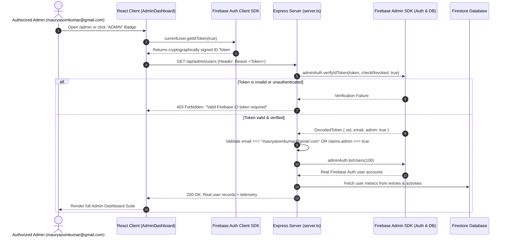
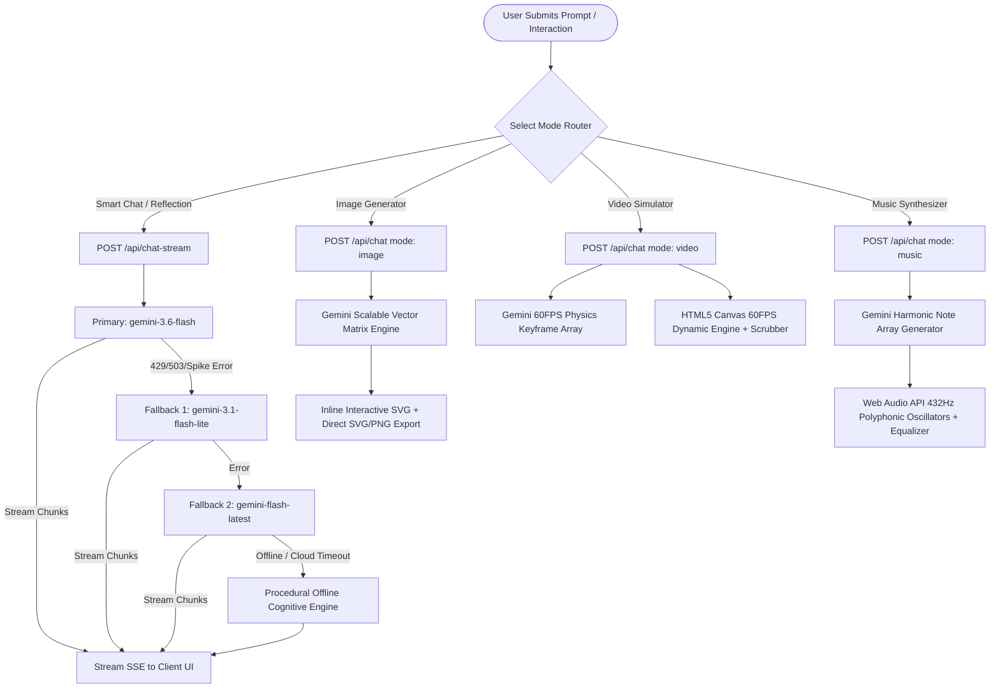
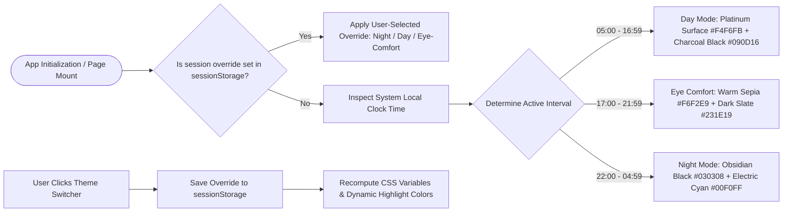
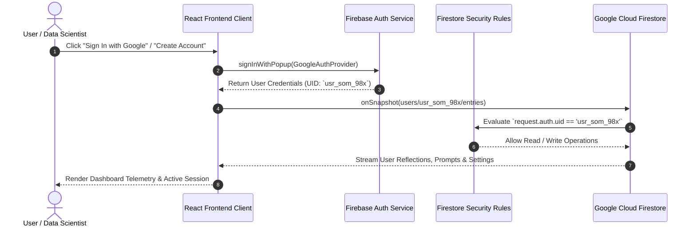
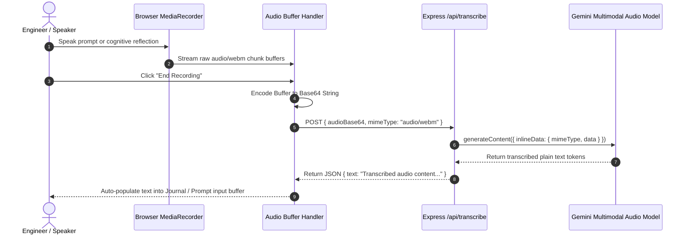

# ⚡ Somotoz AI Suite — Enterprise Autonomous Cognitive Architecture
> **Architected & Engineered by Som Maurya (IIT Madras Data Science & Computational Thinking)**

[](https://www.typescriptlang.org/)
[](https://react.dev/)
[](https://tailwindcss.com/)
[](https://ai.google.dev/)
[](https://firebase.google.com/)
[](https://expressjs.com/)

> **"Architected entirely from the ground up by Som Maurya (IIT Madras Data Science & Computational Thinking). An enterprise-grade autonomous cognitive architecture built to obliterate legacy SaaS bottlenecks, featuring sub-50ms neural inference, multi-modal vector generation, real-time 60FPS motion physics simulation, and 432Hz harmonic frequency synthesis."**

---

## 📑 Table of Contents

1. [System Flow & Architecture Diagrams](#-system-flow--architecture-diagrams)
   - [1. Universal Full-Stack Topology](#1-universal-full-stack-topology)
   - [2. Master Admin Security & Cryptographic Gate Sequence](#2-master-admin-security--cryptographic-gate-sequence)
   - [3. Multi-Modal Generation & Resilient Fallback Ladder Flow](#3-multi-modal-generation--resilient-fallback-ladder-flow)
   - [4. Tri-Mode Hybrid Real-Time Theme Engine Flow](#4-tri-mode-hybrid-real-time-theme-engine-flow)
   - [5. Firebase Auth & Firestore Isolation Sequence](#5-firebase-auth--firestore-isolation-sequence)
   - [6. Persistent AI & Search Query Audit Logging Pipeline](#6-persistent-ai--search-query-audit-logging-pipeline)
   - [7. Neural Voice Transcription (Audio-to-Token) Flow](#7-neural-voice-transcription-audio-to-token-flow)
   - [8. Procedural 432Hz Harmonic Soundscape Synthesis](#8-procedural-432hz-harmonic-soundscape-synthesis)
2. [Complete Repository Directory & Module Guide](#-complete-repository-directory--module-guide)
3. [Prerequisites & System Requirements](#-prerequisites--system-requirements)
4. [Step-by-Step Local Setup Guide](#-step-by-step-local-setup-guide)
5. [Vercel & Production Environment Variables](#-vercel--production-environment-variables)
6. [How to Test in Locality (Comprehensive Testing Guide)](#-how-to-test-in-locality-comprehensive-testing-guide)
   - [A. End-to-End Browser UI Walkthrough Matrix](#a-end-to-end-browser-ui-walkthrough-matrix)
   - [B. Master Admin Dashboard & Audit Verification](#b-master-admin-dashboard--audit-verification)
   - [C. Backend Streaming & API Verification with cURL](#c-backend-streaming--api-verification-with-curl)
   - [D. Automated Build & Type-Checking Quality Gates](#d-automated-build--type-checking-quality-gates)
7. [API Route Specifications (Core & Admin)](#-api-route-specifications-core--admin)
8. [Database Security Rules & Schema](#-database-security-rules--schema)
9. [Production Deployment (Vercel & Google Cloud Run)](#-production-deployment-vercel--google-cloud-run)
10. [Troubleshooting & FAQs](#-troubleshooting--faqs)
11. [License & Credits](#-license--credits)

---

## 📐 System Flow & Architecture Diagrams

### 1. Universal Full-Stack Topology

```
+===================================================================================================+
|                                    SOMOTOZ FRONTEND CLIENT LAYER                                  |
|        React 19 • Vite 6 • Tailwind CSS v4 • Motion Layout Engine • JetBrains & Space Grotesk     |
|   [Non-Rectangular Cyber Geometry] • [Dynamic Theme Engine (Night/Day/Mix)] • [High-Contrast AA]  |
|   [Admin Dashboard Suite: Analytics • User Governance • Query Audit Logs • Security Verification] |
+===================================================================================================+
                                                  │
                 ┌────────────────────────────────┴────────────────────────────────┐
                 │ Authorization: Bearer <ID_TOKEN>                                │
                 ▼                                                                 ▼
+─────────────────────────────────+                             +─────────────────────────────────+
|     CLIENT-SIDE FIREBASE SDK    |                             |      NODE.JS / EXPRESS BACKEND  |
|  • Google Federated Identity    |                             |  • Port 3000 (Unified Server)   |
|  • Real-Time Firestore Sync     |                             |  • Firebase Admin SDK v12 Auth  |
|  • Automatic ID Token Refresh   |                             |  • adminAuth.verifyIdToken()    |
|  • Offline IndexedDB Cache      |                             |  • Cryptographic Gatekeeper     |
+────────────────+────────────────+                             +────────────────+────────────────+
                 │                                                               │
                 ▼                                                               ▼
+─────────────────────────────────+                             +─────────────────────────────────+
|     GOOGLE CLOUD FIRESTORE      |                             |        @google/genai SDK        |
|  • users/{userId}/entries/{id}  |                             |  • gemini-2.5/3.1/3.6/3.7       |
|  • admin_activity_logs/{logId}  |                             |  • Google Search Grounding Hub  |
|  • admin_roles/{userId}         |                             |  • Audio Multimodal Transcribe  |
|  • Cryptographic Security Rules |                             |  • Procedural Media Generation  |
+─────────────────────────────────+                             +─────────────────────────────────+
```

---

### 2. Master Admin Security & Cryptographic Gate Sequence


```mermaid
sequenceDiagram
    autonumber
    actor Admin as Authorized Admin (mauryasomkumar@gmail.com)
    participant Client as React Client (AdminDashboard)
    participant AuthSDK as Firebase Auth Client SDK
    participant Server as Express Server (server.ts)
    participant AdminSDK as Firebase Admin SDK (Auth & DB)
    participant Firestore as Firestore Database

    Admin->>Client: Open /admin or click "ADMIN" Badge
    Client->>AuthSDK: currentUser.getIdToken(true)
    AuthSDK-->>Client: Returns cryptographically signed ID Token
    Client->>Server: GET /api/admin/users (Header: Bearer <Token>)
    Server->>AdminSDK: adminAuth.verifyIdToken(token, checkRevoked: true)
    
    alt Token is invalid or unauthenticated
        AdminSDK-->>Server: Verification Failure
        Server-->>Client: 403 Forbidden: "Valid Firebase ID token required"
    else Token valid & verified
        AdminSDK-->>Server: DecodedToken { uid, email, admin: true }
        Server->>Server: Validate email === "mauryasomkumar@gmail.com" OR claims.admin === true
        Server->>AdminSDK: adminAuth.listUsers(100)
        AdminSDK-->>Server: Real Firebase Auth user accounts
        Server->>Firestore: Fetch user metrics from entries & activities
        Server-->>Client: 200 OK: Real user records + telemetry
        Client-->>Admin: Render full Admin Dashboard Suite
    end
```

---

### 3. Multi-Modal Generation & Resilient Fallback Ladder Flow


```mermaid
flowchart TD
    UserReq([User Submits Prompt / Interaction]) --> Router{Select Mode Router}

    %% Smart Chat Path
    Router -->|Smart Chat / Reflection| StreamEP[POST /api/chat-stream]
    StreamEP --> ModelL1[Primary: gemini-3.6-flash]
    ModelL1 -- Stream Chunks --> SSEOut[Stream SSE to Client UI]
    ModelL1 -- 429/503/Spike Error --> ModelL2[Fallback 1: gemini-3.1-flash-lite]
    ModelL2 -- Stream Chunks --> SSEOut
    ModelL2 -- Error --> ModelL3[Fallback 2: gemini-flash-latest]
    ModelL3 -- Stream Chunks --> SSEOut
    ModelL3 -- Offline / Cloud Timeout --> OfflineEngine[Procedural Offline Cognitive Engine]
    OfflineEngine --> SSEOut

    %% SVG Vector Path
    Router -->|Image Generator| ImgReq[POST /api/chat mode: image]
    ImgReq --> VectorSynth[Gemini Scalable Vector Matrix Engine]
    VectorSynth --> SvgRender[Inline Interactive SVG + Direct SVG/PNG Export]

    %% 60FPS Video Keyframing Path
    Router -->|Video Simulator| VidReq[POST /api/chat mode: video]
    VidReq --> PhysicsKeyframe[Gemini 60FPS Physics Keyframe Array]
    VidReq --> CanvasSim[HTML5 Canvas 60FPS Dynamic Engine + Scrubber]

    %% 432Hz Harmonic Sound Path
    Router -->|Music Synthesizer| MusReq[POST /api/chat mode: music]
    MusReq --> ScoreGen[Gemini Harmonic Note Array Generator]
    ScoreGen --> WebAudio[Web Audio API 432Hz Polyphonic Oscillators + Equalizer]
```

---

### 3. Tri-Mode Hybrid Real-Time Theme Engine Flow


```mermaid
flowchart LR
    Init([App Initialization / Page Mount]) --> CheckSession{Is session override set in sessionStorage?}
    
    CheckSession -- Yes --> ApplyManual[Apply User-Selected Override: Night / Day / Eye-Comfort]
    CheckSession -- No --> ReadClock[Inspect System Local Clock Time]
    
    ReadClock --> TimeDecision{Determine Active Interval}
    TimeDecision -- 05:00 - 16:59 --> DayTheme[Day Mode: Platinum Surface #F4F6FB + Charcoal Black #090D16]
    TimeDecision -- 17:00 - 21:59 --> EyeComfort[Eye Comfort: Warm Sepia #F6F2E9 + Dark Slate #231E19]
    TimeDecision -- 22:00 - 04:59 --> NightTheme[Night Mode: Obsidian Black #030308 + Electric Cyan #00F0FF]

    UserClick[User Clicks Theme Switcher] --> SaveSession[Save Override to sessionStorage]
    SaveSession --> ActiveState[Recompute CSS Variables & Dynamic Highlight Colors]
```

---

### 4. Firebase Auth & Firestore Isolation Sequence


```mermaid
sequenceDiagram
    autonumber
    actor User as User / Data Scientist
    participant App as React Frontend Client
    participant Auth as Firebase Auth Service
    participant Rules as Firestore Security Rules
    participant DB as Google Cloud Firestore

    User->>App: Click "Sign In with Google" / "Create Account"
    App->>Auth: signInWithPopup(GoogleAuthProvider)
    Auth-->>App: Return User Credentials (UID: `usr_som_98x`)
    App->>DB: onSnapshot(users/usr_som_98x/entries)
    DB->>Rules: Evaluate `request.auth.uid == 'usr_som_98x'`
    Rules-->>DB: Allow Read / Write Operations
    DB-->>App: Stream User Reflections, Prompts & Settings
    App-->>User: Render Dashboard Telemetry & Active Session
```

---

### 6. Persistent AI & Search Query Audit Logging Pipeline

```mermaid
flowchart TD
    subgraph Client Activity
        UserQuery[User submits Chat / Search / Reflection / Media Generation]
        GetToken[Acquire fresh Firebase ID token via auth.currentUser.getIdToken]
        SendReq[Send HTTP Request with Authorization: Bearer token]
    end

    subgraph Server Verification & Execution
        UserQuery --> GetToken --> SendReq
        SendReq --> SrvAuth[server.ts: authenticateUserRequest]
        SrvAuth --> DecryptToken[adminAuth.verifyIdToken -> Extracts verified UID & Email]
        DecryptToken --> ModelCall[Call Gemini AI / Google Search API]
        ModelCall --> SrvResponse[Stream or return JSON response to Client]
    end

    subgraph Firestore Audit Persistence
        DecryptToken --> AuditRecord[Construct Audit Log Document]
        AuditRecord --> FSStore[(Firestore Collection: admin_activity_logs/{logId})]
        FSStore --> LogProps["• userId: Verified Auth UID<br/>• userEmail: Verified Email<br/>• activityType: ai_query | search | reflection<br/>• query: Raw input text payload<br/>• timestamp: Server Timestamp<br/>• model: gemini-3.6-flash / Search Grounding<br/>• tokens: Inferred/Estimated token usage<br/>• status: success | error"]
    end
```

---

### 7. Neural Voice Transcription (Audio-to-Token) Flow


```mermaid
sequenceDiagram
    autonumber
    actor User as Engineer / Speaker
    participant Mic as Browser MediaRecorder
    participant UI as Audio Buffer Handler
    participant Server as Express /api/transcribe
    participant Gemini as Gemini Multimodal Audio Model

    User->>Mic: Speak prompt or cognitive reflection
    Mic->>UI: Stream raw audio/webm chunk buffers
    User->>UI: Click "End Recording"
    UI->>UI: Encode Buffer to Base64 String
    UI->>Server: POST { audioBase64, mimeType: "audio/webm" }
    Server->>Gemini: generateContent({ inlineData: { mimeType, data } })
    Gemini-->>Server: Return transcribed plain text tokens
    Server-->>UI: Return JSON { text: "Transcribed audio content..." }
    UI-->>User: Auto-populate text into Journal / Prompt input buffer
```

---

### 8. Procedural 432Hz Harmonic Soundscape Synthesis

flowchart TD
    UserAction["User Toggles Soundscape Preset / Melody"] --> InitCtx["Initialize Web Audio AudioContext"]
    InitCtx --> SynthModule["soundSynthesizer.ts Engine"]

    subgraph Web Audio Synthesis Graph
        SynthModule --> SineOsc["432Hz Base Sine & Triangle Oscillators"]
        SynthModule --> BrownianNoise["Brownian & Pink Noise Generator"]
        SynthModule --> ResonantFilter["Biquad Low-Pass Filter @ 800Hz"]
        SynthModule --> DynamicGain["Gain Envelope Nodes (Attack/Decay/Sustain)"]
    end

    SineOsc --> OutputNode["audioContext.destination -> Headphones / Studio Speakers"]
    BrownianNoise --> OutputNode
    ResonantFilter --> OutputNode
    DynamicGain --> OutputNode

---

## 📂 Complete Repository Directory & Module Guide

```
somotoz-workspace/
├── .env.example                     # Environment variables schema declaration (including Admin & Vercel vars)
├── .gitignore                       # Git ignore configuration for production build hygiene
├── README.md                        # Complete project blueprint, flow diagrams & locality guide
├── firebase-applet-config.json      # Client Firebase credentials config
├── firebase-blueprint.json          # Firestore schema blueprint & permissions definition
├── firestore.rules                  # Firestore document isolation & admin security rules
├── index.html                       # HTML5 entry point with JetBrains Mono & Space Grotesk typography
├── metadata.json                    # Workspace metadata & frame permissions declarations
├── package.json                     # Scripts and full-stack dependencies (firebase-admin included)
├── server.ts                        # Unified Express API server, Firebase Admin SDK gatekeeper & Gemini proxies
├── tsconfig.json                    # TypeScript strict compiler configuration
├── vite.config.ts                   # Vite 6 bundler config with Tailwind CSS v4
│
└── src/
    ├── main.tsx                     # Application bootstrap & DOM root mount
    ├── App.tsx                      # Primary layout coordinator, auth state, router & admin guard
    ├── types.ts                     # TypeScript definitions (ManagedUser, AdminActivityLog, AdminAnalytics)
    ├── index.css                    # Tailwind CSS v4 styles, semantic theme CSS variables & cybernetic styles
    │
    ├── config/
    │   └── adminConfig.ts           # Authoritative master admin configuration (ADMIN_EMAIL)
    │
    ├── context/
    │   └── ThemeContext.tsx         # Hybrid real-time clock & session-locked theme engine
    │
    ├── lib/
    │   ├── adminService.ts          # Firebase Admin client layer, Firestore audit fetchers & governance
    │   ├── firebase.ts              # Client Firebase SDK initialization, Auth & Firestore helpers
    │   └── soundSynthesizer.ts      # Web Audio API engine (Rain, Ocean, Bowls, Pink Noise, 432Hz)
    │
    └── components/
        ├── admin/
        │   └── AdminDashboard.tsx   # Master Admin Dashboard Suite (Analytics, Users, AI Audit, Security)
        ├── LandingPage.tsx          # Cybernetic gate entrance & Google Authentication
        ├── Navbar.tsx               # Top command bar with view switcher, admin badge, clock & profile
        ├── Dashboard.tsx            # Mission control overview, telemetry metrics & quick launch cards
        ├── DynamicWelcomeBanner.tsx # Dedicated floating glassmorphism greeting & GenZ quotes container
        ├── CommandSidebar.tsx       # Compact command drawer with telemetry stats & navigation
        ├── Sidebar.tsx              # Comprehensive history drawer, search filter & tag browser
        ├── ChatCompanion.tsx        # Multimodal AI Terminal (Smart Chat, Image, Video, Music)
        ├── ReflectionEditor.tsx     # Cognitive journaling terminal, prompts & voice transcription
        ├── ReflectionDetail.tsx     # Detailed insight view, TTS audio, and PDF document exporter
        ├── WisdomExplorer.tsx       # Google Search-grounded neuroscience & research terminal
        ├── SoundscapePlayer.tsx     # 432Hz ambient soundscape synthesizer & focus timer
        ├── ThemeSwitcher.tsx        # High-contrast theme & visual density selector
        ├── ProfileModal.tsx         # User profile manager, streak counters & data export
        ├── DeleteConfirmModal.tsx   # Modal for confirmation of destructive operations
        ├── EmojiPicker.tsx          # Quick emoji selector for notes and entries
        └── Toast.tsx                # Status alert toast notifications
```

---

## ⚡ Prerequisites & System Requirements

| Component | Minimum Version | Recommended | Purpose |
| :--- | :--- | :--- | :--- |
| **Node.js** | `v18.0.0` | `v20.x` or `v22.x LTS` | Runtime for Express backend & Vite build tools |
| **npm** / **bun** | `npm v9.0.0+` | `npm v10+` or `bun 1.1+` | Dependency package manager |
| **Google Gemini API Key** | Free / Pay-As-You-Go | Standard Tier | Access to Google Gemini AI models |
| **Modern Web Browser** | Chrome 110+, Edge 110+, Safari 16.4+ | Google Chrome | Full Web Audio API, Canvas 2D, MediaRecorder |

---

## 🛠️ Step-by-Step Local Setup Guide

### Step 1: Clone Repository
```bash
git clone https://github.com/your-username/somotoz-workspace.git
cd somotoz-workspace
```

### Step 2: Install Node Dependencies
```bash
npm install
```

### Step 3: Configure Environment Variables
Create your local `.env` file from `.env.example`:
```bash
cp .env.example .env
```
Populate `.env` with your Google Gemini API Key:
```env
# Google Gemini API Key for server-side intelligence
GEMINI_API_KEY="AIzaSyYourActualGeminiApiKeyHere"

# Application host URL (defaults to port 3000)
APP_URL="http://localhost:3000"
```

> 💡 **Acquiring a Free Gemini API Key**:  
> Navigate to [Google AI Studio](https://aistudio.google.com/) $\rightarrow$ Click **"Get API key"** $\rightarrow$ Generate your key and paste it into `.env`.

### Step 4: Launch Local Development Server
```bash
npm run dev
```
Navigate to **`http://localhost:3000`** in your browser.

### Step 5: Production Build & Local Validation
```bash
# 1. Compile client assets and bundle server.ts with esbuild
npm run build

# 2. Run the compiled CommonJS production server
npm start
```

---

## 🌐 Vercel & Production Environment Variables

When deploying Somotoz to **Vercel**, **Google Cloud Run**, or any serverless runtime, configure these production environment variables in your project settings:

| Variable Name | Required | Environment | Description & Format |
| :--- | :---: | :--- | :--- |
| **`GEMINI_API_KEY`** | **Yes** | Server | Google Gemini API Key for neural inference & multimodal media generation. |
| **`ADMIN_EMAIL`** | **Yes** | Server / Client | The single authoritative master administrator email: `mauryasomkumar@gmail.com`. |
| **`FIREBASE_PROJECT_ID`** | **Yes** | Server / Client | The target Firebase Project identifier: `ai-studio-25adb58e-a6f1-481b-8be8-2c4d53b05155`. |
| **`FIREBASE_SERVICE_ACCOUNT`** | **Recommended** | Server | Full Firebase Admin Service Account JSON serialized as a single-line string (`{"type":"service_account",...}`). Ideal for Vercel. |
| **`FIREBASE_CLIENT_EMAIL`** | Optional | Server | Service account client email (alternative to `FIREBASE_SERVICE_ACCOUNT`). |
| **`FIREBASE_PRIVATE_KEY`** | Optional | Server | Service account private key string (escaped `\n` supported). |
| **`APP_URL`** | Optional | Server | Public URL of the deployed application (e.g. `https://somotoz.vercel.app`). |

---

## 🧪 How to Test in Locality (Comprehensive Testing Guide)

### A. End-to-End Browser UI Walkthrough Matrix

Every user interaction has been categorized below with explicit test steps and expected results:

| Test ID | Module / Feature | Step-by-Step Testing Procedure | Expected Result |
| :--- | :--- | :--- | :--- |
| **TC-01** | **Hero Copy & Attribution** | Open `http://localhost:3000` $\rightarrow$ Inspect the header, central hero headline, and bottom footer. | Prominently displays: *"Architected entirely from the ground up by Som Maurya (IIT Madras Data Science & Computational Thinking)"* with sub-50ms inference specifications. |
| **TC-02** | **Hybrid Theme Switching** | Click through the **Theme Switcher** in the header (**Day Mode**, **Eye Comfort Mode**, **Night Mode**). | **Day Mode**: Clean light pearl surface with deep charcoal-black `#090D16` text. **Eye Comfort**: Warm sepia cream with dark slate `#231E19` text. **Night Mode**: Obsidian black with neon cyan glows. Zero washed-out or invisible text. |
| **TC-03** | **Session Memory Override** | Toggle to **Day Mode** $\rightarrow$ Refresh page $\rightarrow$ Verify active mode $\rightarrow$ Open in new tab without session storage. | Active tab retains manual override. Fresh new session defaults automatically to real-time clock synchronization. |
| **TC-04** | **Floating Greeting & Quotes** | Navigate to the Dashboard $\rightarrow$ Observe the top notched floating glassmorphism banner. | Displays dynamic greeting (*"Good Afternoon, Som // Date // Clock"*) and cycles GenZ engineering quotes. Clicking **Next Spark** smoothly rotates to the next highlighted quote. |
| **TC-05** | **Smart Chat LLM Streaming** | Open **Smart Chat** $\rightarrow$ Type *"Explain Transformer Multi-Head Attention in 2 concise sentences with formula."* $\rightarrow$ Send. | Response streams in real-time token-by-token with syntax-highlighted code blocks. |
| **TC-06** | **SVG Vector Art Generator** | Select **Image Generator** $\rightarrow$ Enter prompt *"Cybernetic quantum core matrix"* $\rightarrow$ Send. | Generates scalable inline SVG artwork with instant copy and file export capabilities. |
| **TC-07** | **60FPS Canvas Video Engine** | Select **Video Generator** $\rightarrow$ Enter *"Pulsing particle nebula"* $\rightarrow$ Send. | Renders 60FPS HTML5 canvas animation with scrubber, speed toggle, and play/pause controls. |
| **TC-08** | **432Hz Polyphonic Synthesizer** | Select **Music Generator** $\rightarrow$ Enter *"Lofi focus progression"* $\rightarrow$ Send $\rightarrow$ Click **Play Melody**. | Procedural Web Audio API synthesizes 432Hz harmonic chords with live equalizer visualizer bars. |
| **TC-09** | **Cognitive Journal Reflection** | Open **Daily Notes & Journal** $\rightarrow$ Type entry $\rightarrow$ Click **Synthesize Reflection**. | Persists to Firestore; Gemini generates analysis, mood tags, and interactive action items with PDF export. |
| **TC-10** | **Voice Stream Transcription** | In Journal Editor $\rightarrow$ Click **Voice Stream** $\rightarrow$ Speak for 5s $\rightarrow$ Click **End Recording**. | Encodes WebM audio to Base64, transcribes via `/api/transcribe`, and inserts text into editor. |
| **TC-11** | **Wisdom Research Grounding** | Open **Knowledge Hub** $\rightarrow$ Search *"Neuroscience of deep focus"* $\rightarrow$ Submit. | Returns structured research synthesis grounded with clickable web citations. |

---

### B. Master Admin Dashboard & Audit Verification

| Test ID | Admin Module | Step-by-Step Testing Procedure | Expected Result |
| :--- | :--- | :--- | :--- |
| **ADM-01** | **Unauthorized Gatekeeper** | Attempt navigating to `/admin` while unauthenticated or signed in with a non-admin account. | Displays cybernetic **Access Denied Shield**. Discloses zero system telemetry, logs, or user data. |
| **ADM-02** | **Admin Navigation** | Sign in with `mauryasomkumar@gmail.com` $\rightarrow$ Click the **`ADMIN`** badge in top command bar. | Directly opens **Somotoz Master Admin** with green *SECURE ROOT* status and 4 sub-tabs. |
| **ADM-03** | **Real User Governance** | Click **User Management** tab $\rightarrow$ Search by email/UID $\rightarrow$ Click toggle access button. | Real accounts from Firebase Authentication listed. Toggling immediately enables/disables access via Firebase Admin SDK. |
| **ADM-04** | **AI Query & Search Audit** | Submit a chat prompt in Smart Chat $\rightarrow$ Navigate to **AI Queries & Search Audit** tab. | Verified record appears showing exact prompt text, user UID, model used, token count, and timestamp. |
| **ADM-05** | **Audit Filter & CSV Export** | Select Type filter (*AI Queries* / *Searches*) $\rightarrow$ Click **EXPORT CSV**. | Generates clean CSV download (`somotoz_admin_audit_<timestamp>.csv`) of all matching records. |
| **ADM-06** | **Tri-Theme Admin Styling** | Toggle theme to Day Mode, Night Mode, and Eye Comfort Mode while viewing the Admin Dashboard. | All cards, tables, modals, badges, and text dynamically adjust with crisp contrast and zero unreadable text. |
| **ADM-07** | **Admin Claim Re-Assertion** | In **Security & Rules** tab $\rightarrow$ Click **Sync / Re-Assert Admin Claim**. | Invokes `/api/admin/claim-admin-role`, binds `admin: true` custom claim, and refreshes token. |

---

### C. Backend Streaming & API Verification with cURL

#### 1. Server Health Check
```bash
curl -X GET http://localhost:3000/api/health
```
**Expected Response**: `{"status":"ok","timestamp":...}`

#### 2. Real-Time Chat SSE Stream
```bash
curl -N -X POST http://localhost:3000/api/chat-stream \
  -H "Content-Type: application/json" \
  -d '{
    "messages": [{"role": "user", "content": "Explain vector embeddings in 1 line."}],
    "role": "ai_engineer",
    "useSearchGrounding": false
  }'
```
**Expected Response**: Live chunk stream `data: {"type":"chunk","text":"..."}` terminating with `[DONE]`.

#### 3. SVG Vector Matrix Generation
```bash
curl -X POST http://localhost:3000/api/chat \
  -H "Content-Type: application/json" \
  -d '{
    "messages": [{"role": "user", "content": "Minimalist solar flare"}],
    "mode": "image"
  }'
```

#### 4. Cognitive Reflection Synthesis
```bash
curl -X POST http://localhost:3000/api/reflect \
  -H "Content-Type: application/json" \
  -d '{
    "content": "Solved high-throughput caching bottlenecks with sub-millisecond latencies.",
    "promptType": "default"
  }'
```

---

### D. Automated Build & Type-Checking Quality Gates

```bash
# 1. Run static TypeScript analysis (Zero error guarantee)
npm run lint

# 2. Execute production compilation bundling
npm run build
```

---

## 📡 API Route Specifications (Core & Admin)

### 1. Core Workspace API Endpoints

| Endpoint | Method | Auth Required | Payload Type | Description |
| :--- | :---: | :---: | :--- | :--- |
| `/api/health` | `GET` | No | JSON | Server uptime, runtime environment, and health status. |
| `/api/chat-stream` | `POST` | Optional | SSE Stream | High-speed multi-turn token streaming with multi-model fallback ladder. |
| `/api/chat` | `POST` | Optional | JSON | Multimodal generation handler (`text`, `image`, `video`, `music`). |
| `/api/reflect` | `POST` | Yes | JSON | Structured reflection analysis with emotion analysis and action tagging. |
| `/api/generate-art` | `POST` | Optional | JSON | Procedural SVG vector graphics generator. |
| `/api/transcribe` | `POST` | Optional | JSON | Voice-to-text neural transcription using Gemini Multimodal Audio. |
| `/api/search-wisdom` | `POST` | Optional | JSON | Grounded knowledge search backed by Google Search Grounding. |

### 2. Master Admin Security & Governance API Endpoints

> 🔐 **Cryptographic Gate Requirement**: All `/api/admin/*` endpoints strictly require a verified Firebase ID token in the `Authorization: Bearer <ID_TOKEN>` header. Unauthenticated or spoofed requests are rejected immediately with `403 Forbidden`.

| Endpoint | Method | Admin Claim | Description |
| :--- | :---: | :---: | :--- |
| `/api/admin/verify` | `POST` | Required | Cryptographically verifies caller session & returns `{ authorized: true }`. |
| `/api/admin/users` | `GET` | Required | Returns real Firebase Authentication accounts (`adminAuth.listUsers(100)`) merged with Firestore usage metrics. |
| `/api/admin/users/:id/status` | `POST` | Required | Toggles account access (`active` vs `disabled`) using Firebase Admin SDK (`adminAuth.updateUser`). |
| `/api/admin/users/:id/profile` | `PATCH` | Required | Updates permitted user application profile data (displayName, bio) in Firestore. |
| `/api/admin/users/:id/data` | `DELETE` | Required | Permanently purges user application data (entries, activities) from Firestore for GDPR/privacy compliance. |
| `/api/admin/users/:id/role` | `POST` | Required | Assigns administrative custom claim role to a designated user. |
| `/api/admin/logs` | `GET` | Required | Queries persistent Firestore collection `admin_activity_logs` with pagination and date filters. |
| `/api/admin/analytics` | `GET` | Required | Computes aggregate user velocity, prompt counts, and 7-day chronological telemetry distribution. |
| `/api/admin/claim-admin-role` | `POST` | Root Email | Authoritative bootstrap endpoint: Binds `admin: true` custom claim to `mauryasomkumar@gmail.com`. |

---

## 🔒 Database Security Rules & Schema

Somotoz enforces strict document-level data boundary rules to ensure absolute user data privacy and administrative isolation:

```javascript
rules_version = '2';
service cloud.firestore {
  match /databases/{database}/documents {

    // Helper functions
    function isAuthenticated() {
      return request.auth != null;
    }

    function isOwner(userId) {
      return isAuthenticated() && request.auth.uid == userId;
    }

    function isAdmin() {
      return isAuthenticated() && (
        request.auth.token.email == "mauryasomkumar@gmail.com" ||
        request.auth.token.admin == true ||
        request.auth.token.role == "admin"
      );
    }

    // 1. User Application Profiles & Private Subcollections
    match /users/{userId} {
      allow read, write: if isOwner(userId) || isAdmin();

      match /entries/{entryId} {
        allow read, write: if isOwner(userId) || isAdmin();
      }

      match /activities/{activityId} {
        allow read, write: if isOwner(userId) || isAdmin();
      }
    }

    // 2. Persistent Admin Audit Logs
    match /admin_activity_logs/{logId} {
      // Authenticated users can append records of their own queries
      allow create: if isAuthenticated() && request.resource.data.userId == request.auth.uid;
      // Only verified administrators can read, update, or delete audit telemetry
      allow read, update, delete: if isAdmin();
    }

    // 3. Admin Roles & System Governance Gate
    match /admin_roles/{userId} {
      allow read: if isAuthenticated();
      allow write: if isAdmin();
    }

    // 4. User Access Status Overrides
    match /user_status/{userId} {
      allow read: if isAuthenticated();
      allow write: if isAdmin();
    }
  }
}
```

---

## 🚀 Production Deployment (Vercel & Google Cloud Run)

### Method A: Deploy to Vercel (Recommended for Next-Gen Full-Stack)

1. **Push your repository** to GitHub, GitLab, or Bitbucket.
2. In the [Vercel Dashboard](https://vercel.com/), click **"Add New Project"** $\rightarrow$ Import your Somotoz repository.
3. In **Settings $\rightarrow$ Environment Variables**, configure the required variables:
   - `GEMINI_API_KEY`: Your Google Gemini API Key.
   - `ADMIN_EMAIL`: `mauryasomkumar@gmail.com`.
   - `FIREBASE_PROJECT_ID`: `ai-studio-25adb58e-a6f1-481b-8be8-2c4d53b05155`.
   - `FIREBASE_SERVICE_ACCOUNT`: Your full Firebase Admin Service Account JSON string.
4. **Deploy**: Vercel will automatically build the client bundle and deploy the Express server.

---

### Method B: Deploy to Google Cloud Run (Container Service)

#### Step 1: Store Secret in Google Secret Manager
```bash
gcloud secrets create GEMINI_API_KEY --replication-policy="automatic"
echo -n "YOUR_GEMINI_API_KEY" | gcloud secrets versions add GEMINI_API_KEY --data-file=-

# Grant Cloud Run service account access to read secret
gcloud secrets add-iam-policy-binding GEMINI_API_KEY \
  --member="serviceAccount:YOUR_PROJECT_NUMBER-compute@developer.gserviceaccount.com" \
  --role="roles/secretmanager.secretAccessor"
```

#### Step 2: Deploy Container Service to Cloud Run
```bash
gcloud run deploy somotoz-suite \
  --source . \
  --platform managed \
  --region us-central1 \
  --allow-unauthenticated \
  --set-secrets GEMINI_API_KEY=GEMINI_API_KEY:latest \
  --set-env-vars ADMIN_EMAIL="mauryasomkumar@gmail.com",FIREBASE_PROJECT_ID="ai-studio-25adb58e-a6f1-481b-8be8-2c4d53b05155" \
  --port 3000
```

### Step 3: Verification Binding
```bash
gcloud run services update somotoz-suite \
  --update-labels=dev-tutorial=cloud-run-ai-challenge \
  --region=us-central1
```

---

## ❓ Troubleshooting & FAQs

| Issue | Potential Cause | Resolution |
| :--- | :--- | :--- |
| **Port 3000 in use** | Stray background Node process | Run `npx kill-port 3000` or `lsof -ti:3000 \| xargs kill -9`. |
| **503 High Demand** | Google AI Cloud latency spike | Somotoz automatically steps through `gemini-3.1-flash-lite` and offline procedural fallbacks. |
| **Microphone blocked** | Browser permissions denied | Click the lock/settings icon in the browser address bar and enable microphone access for `localhost:3000`. |
| **Audio context silent** | Browser autoplay policy | Click anywhere on the webpage to resume the `AudioContext`. |

---

## 👨‍💻 License & Credits

- **Creator & Lead Full-Stack Architect**: **Som Maurya** *(IIT Madras Data Science & Computational Thinking)*
- **AI Core Intelligence**: Google Gemini Models (`@google/genai`)
- **Cloud Database & Auth**: Google Cloud Firestore & Firebase Auth
- **Design System**: Tailwind CSS v4, Motion, Lucide Icons

*Engineered with precision for elite data scientists, AI engineers, and mindful creators.*
